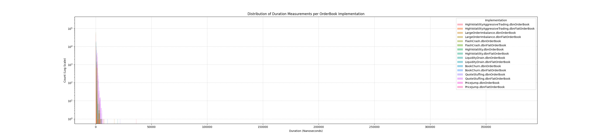
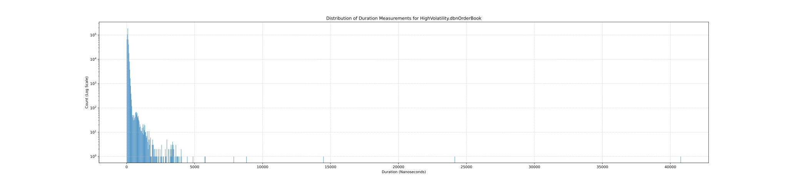
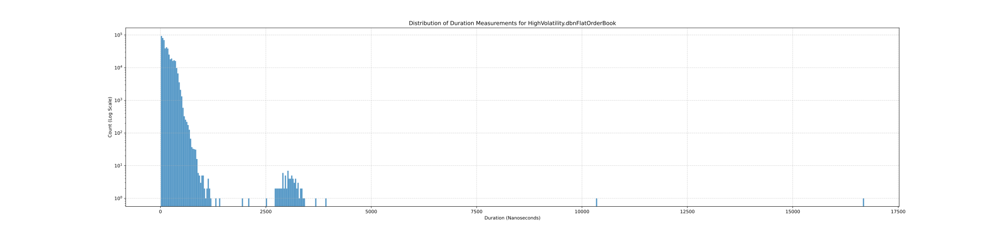

# Exchange Order Book Simulation

## Introduction

This project delves into the critical domain of high-performance order book management for Market by Order (MBO) data. In financial trading, low-latency processing of market data is paramount. This project aims to explore, implement, and benchmark various data structures and algorithmic approaches to build efficient order book solutions. The primary goal is to understand the performance characteristics, particularly latency, of different order book designs under realistic market conditions, thereby identifying optimal strategies for high-frequency trading environments.

## Quick Start

To get a basic understanding and run a simple benchmark:

1.  **Clone the repository:**
    ```bash
    git clone https://github.com/damienruscoe/exchange.git
    git submodule update --init --recursive
    cd exchange
    ```
2.  **Build the project:**
    ```bash
    make all
    ```
3.  **Run a benchmark** (you'll need a DBN file, e.g., `resources/test_data/mbo.dbn`):
    ```bash
    ./benchmark resources/test_data/mbo.dbn
    ```
    This will output latency statistics to your console.

## Project Structure

The project is organized into the following directories:

*   `src/`: Contains all C++ source code.
    *   `src/core/`: Core order book logic and data structures (e.g., `Order`, `ObjectPool`, `OrderBook`, `FlatMapOrderBook`).
    *   `src/apps/`: Main application entry points for benchmarks, statistics generation, and JSON conversion (`benchmark.cpp`, `generate_stats.cpp`, `json_generator.cpp`).
    *   `src/tests/`: Unit tests for the core components (`tests.cpp`).
*   `scripts/`: Contains Python scripts for analysis and plotting (e.g., `plot_stats.py`).
*   `build/`: This directory is generated during the build process and contains compiled object files and executables.
*   `artifacts/`: This directory is generated during execution and stores benchmark results, plots, and other generated output.
*   `dep/`: (Expected to be a sibling directory to the project root) External C++ dependencies like `databento-cpp` and `gtest`.

## Dependencies

This project relies on the following external C++ dependencies, which are expected to be located in a `dep/` directory sibling to the project root:

*   **databento-cpp**: For DBN (Databento Binary Format) file parsing and generation.
*   **Google Test (gtest)**: For unit testing.
*   **Google Benchmark**: For micro-benchmarking.

For Python scripts, the following packages are required:

*   `pandas`
*   `matplotlib`
*   `seaborn`

You can install them using pip:
```bash
pip install pandas matplotlib seaborn
```

## Building the Project

To build the project, navigate to the project root directory (where this `README.md` and the `Makefile` are located) and use `make`.

### All Executables

To build all main executables (`generate_stats`, `json_generator`, `benchmark`, `tests`, `generate_test_data`):

```bash
make all
make test # Builds the test executable
```

### Specific Executables

You can also build specific executables:

```bash
make generate_stats
make json_generator
make benchmark
make run_tests.out
```

### Cleaning the Build

To remove all compiled object files and executables:

```bash
make clean
```

## Generating Test Data (DBN Files)

This project consumes DBN (Databento Binary Format) files as input for its simulations and analysis. A DBN file generator is not included as part of this project. You will need to obtain DBN files externally, for example, from the [Databento platform](https://databento.com/) or by using a separate DBN generation tool.

For the examples below, assume you have a DBN file named `sample_data.dbn`.

## Running Order Book Simulations (Benchmarks)

There are two primary ways to run simulations and collect performance metrics:

### 1. Google Benchmark (`./build/benchmark`)

This executable uses the Google Benchmark library to measure the latency of processing MBO messages across different order book implementations, specifically `OrderBook` and `FlatMapOrderBook`.

**Usage:**
```bash
./build/benchmark <path_to_dbn_file>
```

**Example:**
```bash
./build/benchmark data/sample_data.dbn
```

**Output:**
The output will be printed to the console, showing detailed benchmark results for each benchmarked function. Key metrics include:
*   **Mean/Average Latency:** The average time taken for an operation. Lower is better.
*   **Median Latency:** The middle value of the execution times, providing a robust measure less affected by extreme outliers. Lower is better.
*   **Standard Deviation (StdDev):** A measure of the dispersion of latency values around the mean. A lower standard deviation indicates more consistent and predictable performance, which is critical for low-latency systems. High standard deviation can point to performance "jitter" or inconsistent behavior.
These metrics directly quantify the performance of the order book implementations, allowing for a quick comparison of their average speed and consistency.

### 2. Custom Latency Profiler (`./build/generate_stats`)

This executable provides a custom profiling tool that measures the duration of processing each MBO message and outputs the results to a CSV file. This CSV file is then used by the plotting script.

**Usage:**
```bash
./build/generate_stats <path_to_dbn_file_1> [<path_to_dbn_file_2> ...]
```
You can provide one or more DBN files as input.

**Example:**
```bash
./build/generate_stats data/sample_data.dbn data/another_sample.dbn
```

**Output:**
A CSV file named `benchmark_results.csv` will be created in the `artifacts/` directory. This file contains raw, per-message latency measurements for each message processed by both `OrderBook` and `FlatMapOrderBook` implementations. This granular data is crucial for understanding the full distribution of latencies, including the presence of outliers or "tail latencies" that might be obscured by simple averages. It serves as the input for the `plot_stats.py` script for detailed visualization.

## Running Tests

The project includes unit tests implemented using Google Test.

**To run the tests:**

```bash
./build/run_tests.out
```

**Output:**
The test results will be printed to the console, indicating whether tests passed or failed.

## Profiling and Graphing Latency Distributions

The `scripts/plot_stats.py` script is used to visualize the latency data generated by `./build/generate_stats`. It creates distribution plots (bell curves) for the processing durations.

**Prerequisites:**
Ensure you have the Python dependencies (`pandas`, `matplotlib`, `seaborn`) installed.

**To generate plots:**

1.  First, run the custom latency profiler to generate the `benchmark_results.csv` file:
    ```bash
    ./build/generate_stats data/sample_data.dbn
    ```
2.  Then, execute the plotting script:
    ```bash
    python scripts/plot_stats.py
    ```

**Output:**
The script will generate PNG and SVG image files in the `artifacts/vis/latency/` directory. These include a combined plot showing all implementations and individual plots for each order book implementation. These latency distribution plots (often visualized as histograms or kernel density estimates) are critical for understanding:
*   **Consistency:** A narrow, tall peak indicates highly consistent, low-latency performance. A wide or multi-modal distribution suggests inconsistent behavior.
*   **Tail Latency:** The "tail" of the distribution (the right side of the curve) reveals the worst-case latencies. For low-latency systems, minimizing tail latency (e.g., 99th percentile, 99.9th percentile) is often more important than just the average, as it highlights occasional but significant slowdowns that can impact critical operations.
By visualizing the full distribution, developers can identify performance bottlenecks and areas for optimization that might not be apparent from average latency figures alone.

### Example Latency Distribution Graphs

*(These images are placeholders. They would be generated by following the instructions above and then committed to the repository.)*

#### Combined Latency Distribution



#### OrderBook Latency Distribution



#### FlatMapOrderBook Latency Distribution



## JSON Generation

The `src/apps/json_generator.cpp` application converts DBN data into a JSON format, providing a snapshot of the order book state after each MBO message.

**Usage:**
```bash
./build/json_generator <path_to_dbn_file_1> [<path_to_dbn_file_2> ...]
```

**Example:**
```bash
./build/json_generator data/sample_data.dbn
```

**Output:**
JSON files will be created in the `artifacts/mbp/` directory. For each input DBN file, two JSON files will be generated: one for the `OrderBook` implementation (e.g., `map_sample_data.dbn.json`) and one for the `FlatMapOrderBook` implementation (e.g., `flatmap_sample_data.dbn.json`).

## Generated vs. Non-Generated Files

When working with this project, it's important to distinguish between files that are part of the source code and those that are generated during the build or execution phases.

**Non-Generated (Source) Files - Should be committed to Git:**

*   All files within `src/` (e.g., `.cpp`, `.h` files).
*   All files within `scripts/` (e.g., `.py` files).
*   `Makefile`
*   This `README.md` file.
*   Any DBN files used as input (if you choose to include them in a `data/` directory).

**Generated Files - Should typically be ignored by Git (e.g., via `.gitignore`):**

*   All files and subdirectories within `build/` (object files, executables).
*   All files and subdirectories within `artifacts/` (e.g., `benchmark_results.csv`, `artifacts/mbp/*.json`, `artifacts/vis/latency/*.png`, `artifacts/vis/latency/*.svg`).
*   Executables in the project root (e.g., `generate_stats`, `json_generator`, `benchmark`, `run_tests.out`).

**Exception:** If you include any images in the `README.md` (like the example latency distribution graphs above), these *should* be committed to the repository, even though they are generated, to ensure the `README.md` renders correctly.

## Contributing

Contributions are welcome! Please ensure your code adheres to the existing style and conventions.

## License

This project is licensed under the MIT License. See the LICENSE file for details.
